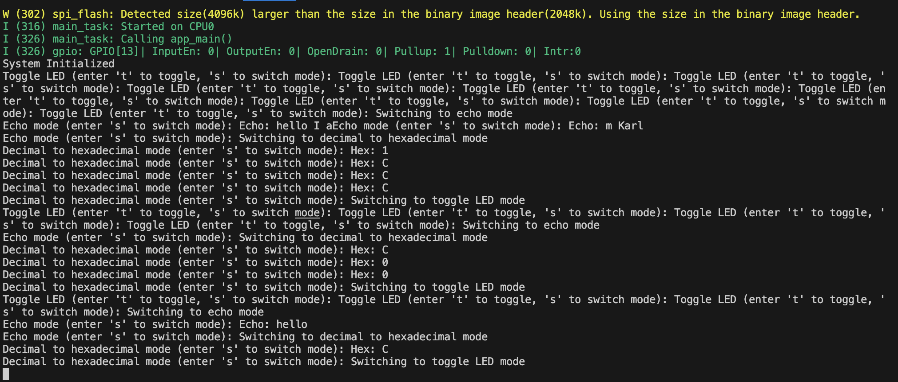

# Console I/O

Karl Carisme
I build a controle I/O where it has three different modes, toggle, echo and conversion.

For the toggle, all you have to do is to press  t on your terminal and it should light up the light on the ESP_IDF board 
and for switching you press s on your terminal to switch to different mode, the echo mode print anything you print on your terminal, and for the conversion, it use decimal numbers and print a hexadecimal numbers to you.

