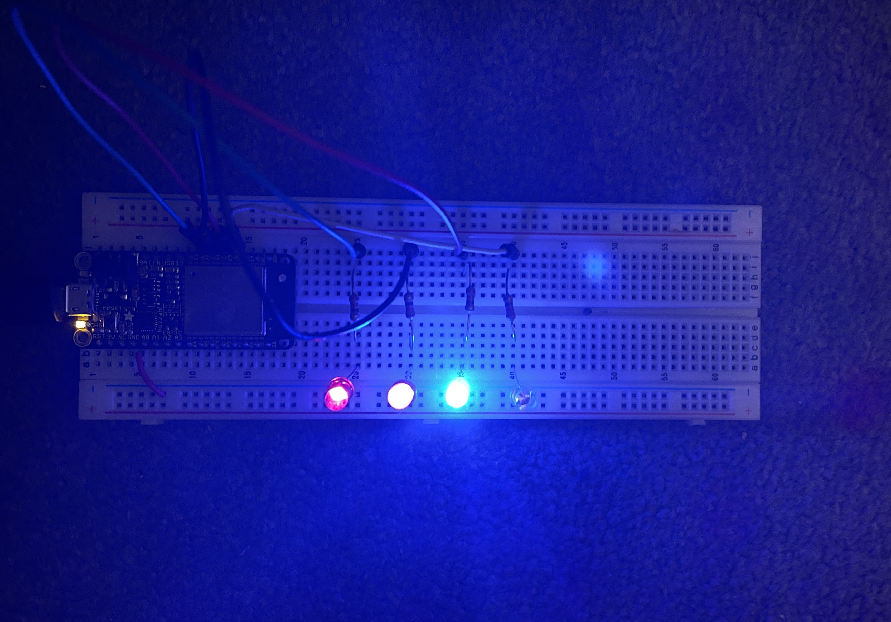

# Karl Carisme

# Description

I wired four LEDs to count in binary from 0 to 15 and then count down from 15 to 1. The GPIO pins power them. The names of the LEDs differ from the code because I did not have the specific colored LEDs available.

