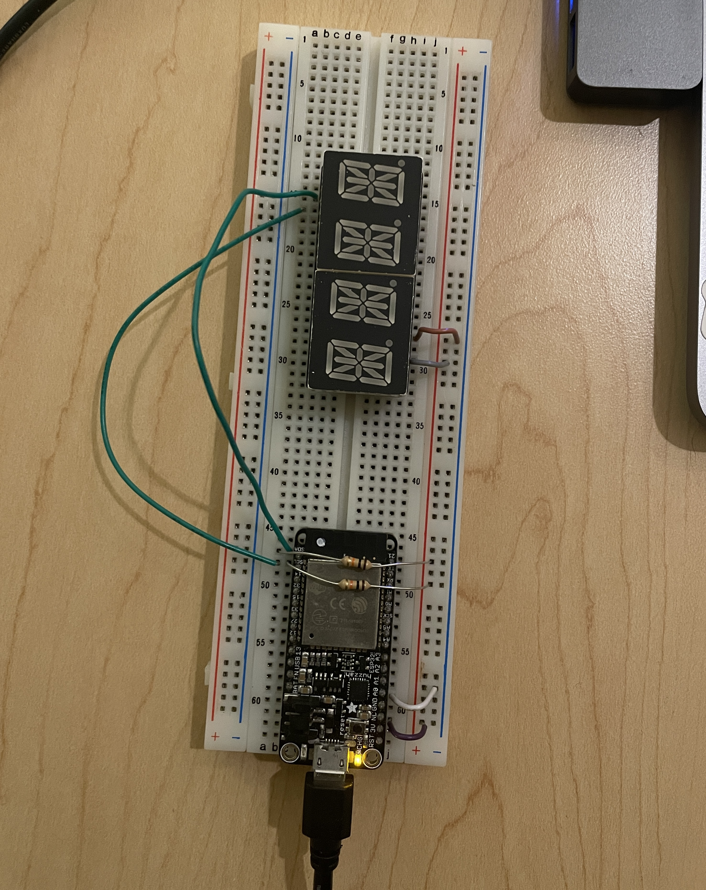
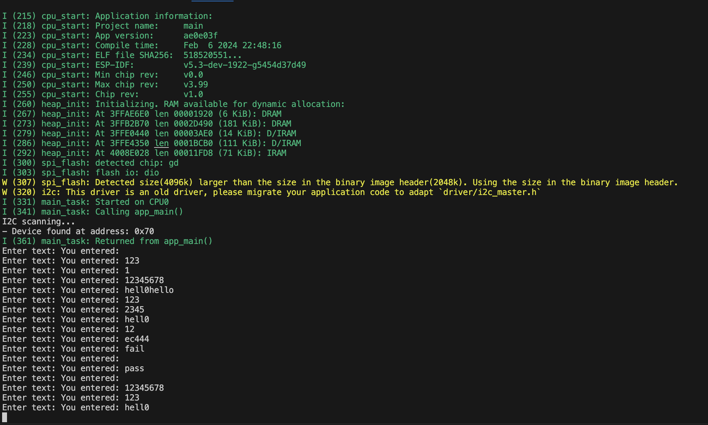

# Karl Carisme 
#02 - 07 - 2024

Please describe in this readme what is in your code folder and
subfolders. Make it easy for us to navigate this space.

# Description

This project enhances an ESP32-based alphanumeric display system, enabling it to dynamically handle and scroll text inputs longer than its four-character limit. By implementing a comprehensive character mapping function, it translates alphanumeric characters into specific segment codes for display. A key feature includes adjustable scrolling speed, allowing users to tailor the readability of scrolling text according to their preferences. The system utilizes I2C communication for device control, alongside an interactive user interface for direct text input and feedback through a terminal. 

#Photos 

# Video of the alphanumeric display

[Watch the Video](https://drive.google.com/file/d/1IIHoDmY9K5mQbJaz9KDXIA2Hy9Q1cWt7/view?usp=sharing)

