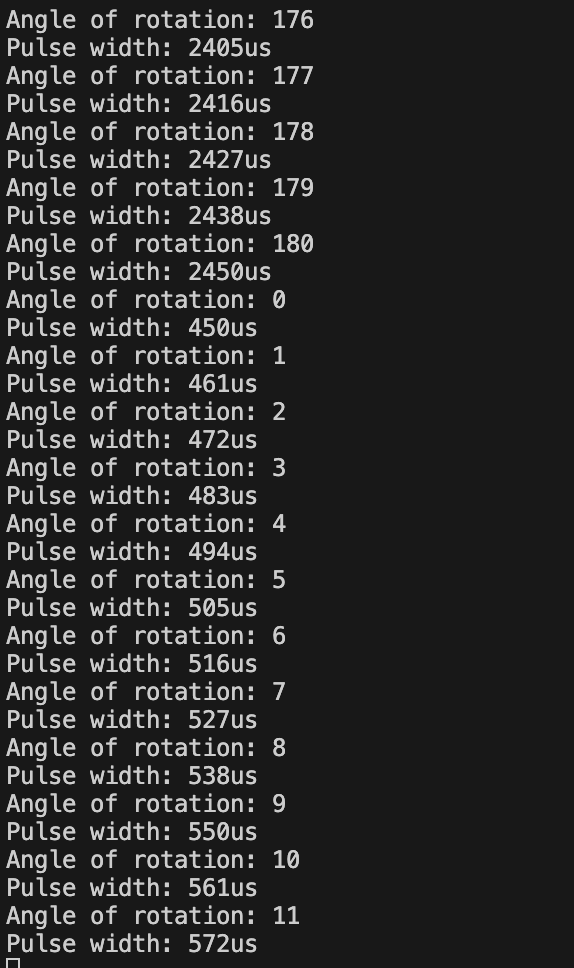

# Karl Carisme
# 02 - 07 - 2024

# Description

I used the ESP32 to control a servo motor. First, I configured a specific pin on the ESP32 to send signals to the motor. Then, I determined how far the motor should turn by adjusting the signal's duration. This adjustment is made by calculating the correct signal duration for the desired angle. By repeating this process in a loop, I enabled the servo to move to different positions smoothly, allowing it to rotate around 180 degrees. This method is straightforward to implement and provides precise control over the servo's movement, making it suitable for a wide variety of projects. I completed this task by using the example code for a servo as a reference.

# Photo

# Video of full rotation

[Here is the video](https://drive.google.com/file/d/1PRfGnlDSOU1Av4kI4oezxMMIhi9palBz/view?usp=sharing)
