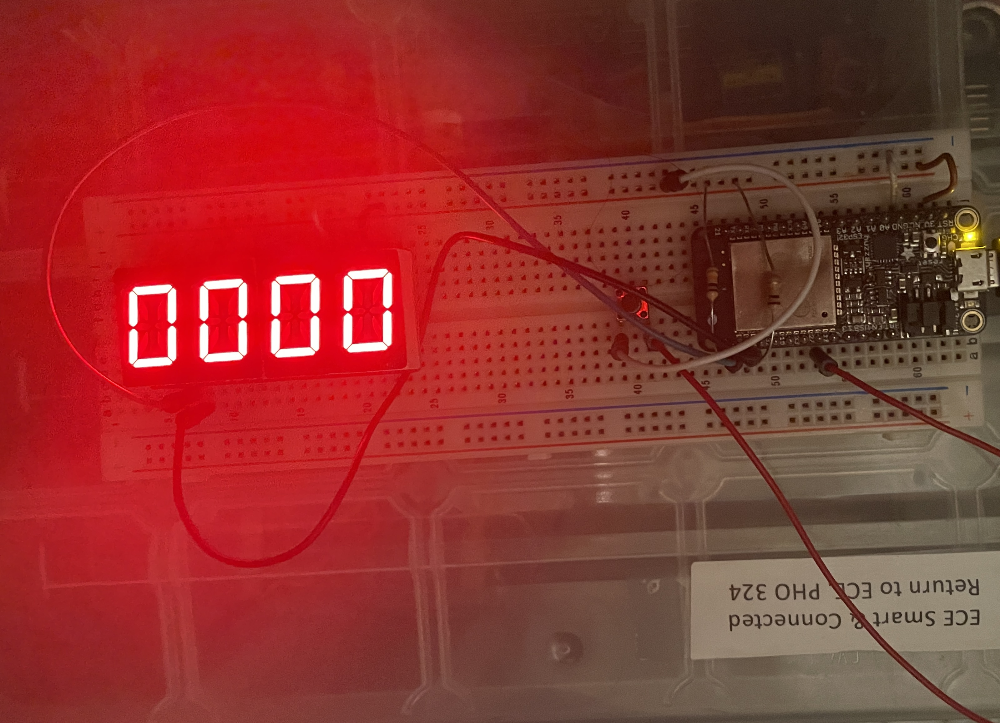

# Karl Carisme
02 - 09 - 2024

# A stopwath that count in mimute and seconds 

# used https://github.com/BU-EC444/04-Code-Examples/blob/main/i2c-display/main/i2c_display.c as reference, and also used my alpha numeric display as refernece

#Photo

#Videos

[video](https://drive.google.com/file/d/1uwaPo9zymUGtdixh4IGasKUnT_7G704_/view?usp=sharing)

