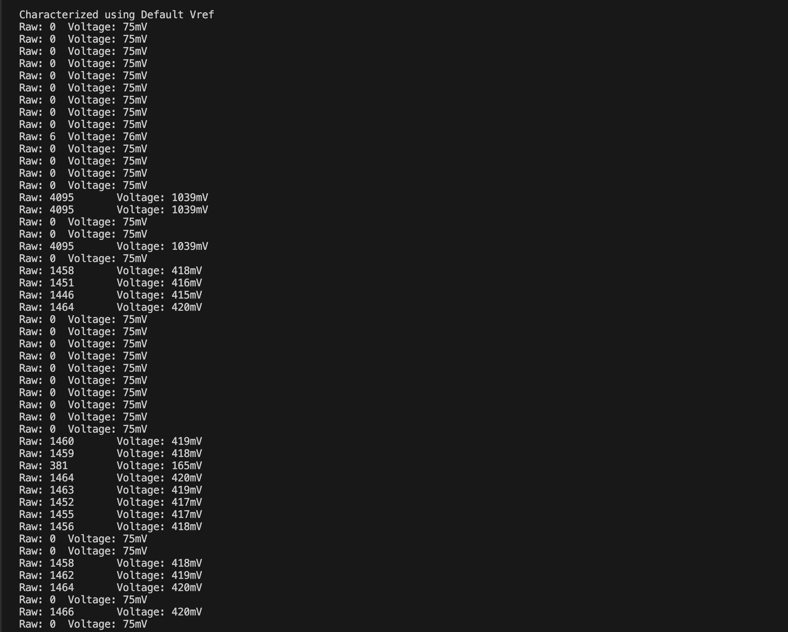

# Karl Carisme
# 02 - 20 - 2024

# Description

In this task, I connected a setup to lower the voltage from the board's 3V to a safe level for the ADC pin, ensuring it didn’t exceed 3.3V. I adjusted the ADC settings so it could correctly read the voltage within the range I needed. I made the ADC check the voltage every 100ms, then averaged these values over one second to get a stable reading. I showed this average voltage on a display and also sent it to the computer screen.

# References 
example code provided.
https://github.com/espressif/esp-idf/tree/39f090a4f1dee4e325f8109d880bf3627034d839/examples/peripherals/adc

source of fourteen segment display charater 
//https://www.wikiwand.com/en/Fourteen-segment_display

<<<<<<< HEAD
# Photo
=======
#Photo
>>>>>>> d164ffe (add my readme)

<<<<<<< HEAD
# Video
=======
#Video
>>>>>>> d164ffe (add my readme)
[watch the video here](https://drive.google.com/file/d/1SPRwl8DHgCisvJCyLgrwwgUIjJapIbSh/view?usp=sharing)
