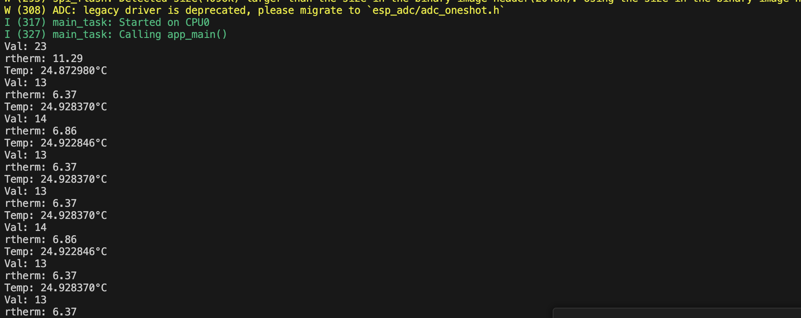

# Karl Carisme
# 02 - 23 - 2024

# Description
This task involves setting up a temperature sensing system with a thermistor and a  2-kiloohms resistor. The system measures the temperature by interpreting the resistor's resistance and uses a formula to translate this into degrees. It continuously measures and reports the temperature every two seconds. 

#Photos

