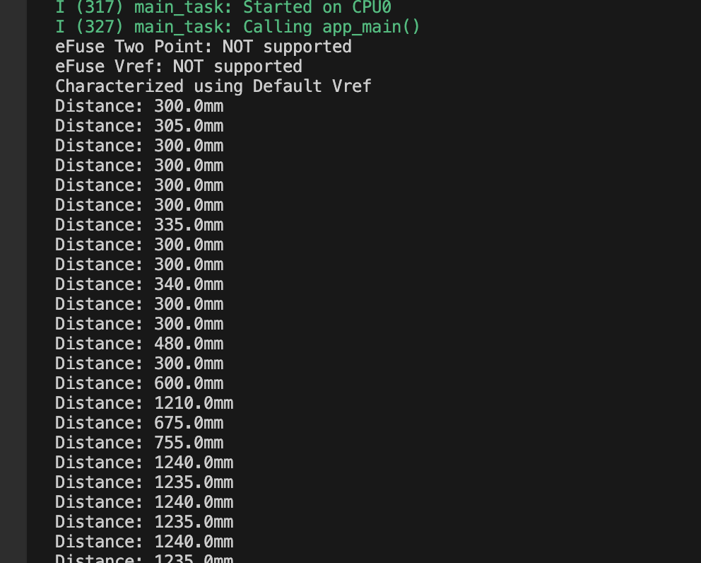
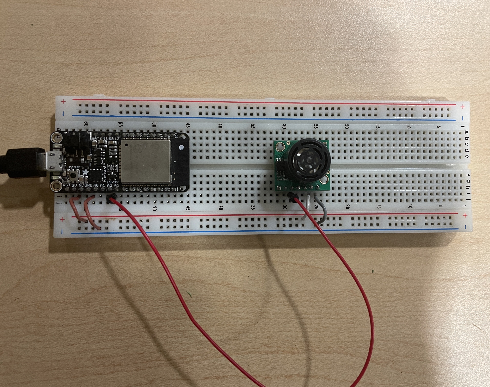

# Karl Crisme
# 02 - 24 - 2024

# Description
The task involves interfacing an ESP32 microcontroller with a Maxbotix ultrasonic sensor to measure distances. The sensor can be connected through various methods, but using UART for accuracy or ADC for simplicity is recommended. The ESP32 is programmed to read the sensor's distance measurements in engineering units (millimeters) and display the results on the console every 2 seconds. The sensor operates between 3.3V to 5.5V.

# Referenre
https://github.com/espressif/esp-idf/blob/39f090a4f1dee4e325f8109d880bf3627034d839/examples/peripherals/adc/main/adc1_example_main.c
Example code was used.

#Screenshot

