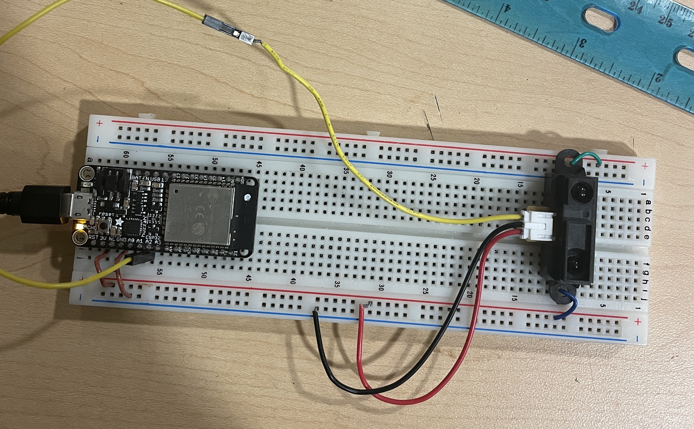

# Karl Carisme

# 02 - 24 - 2024

# Description
I connected a Sharp Long Range IR sensor for distance detection, utilizing an ADC to capture the sensor's raw outputs. These outputs were then translated into specific distance measurements based on their values.

# Reference

https://github.com/espressif/esp-idf/blob/39f090a4f1dee4e325f8109d880bf3627034d839/examples/peripherals/adc/main/adc1_example_main.c

# Photo

# Video

[Watch the video here](https://drive.google.com/file/d/1OFYRZhFvxtqjYufs6nIDUEDyDMJ3DWg-/view?usp=sharing)
