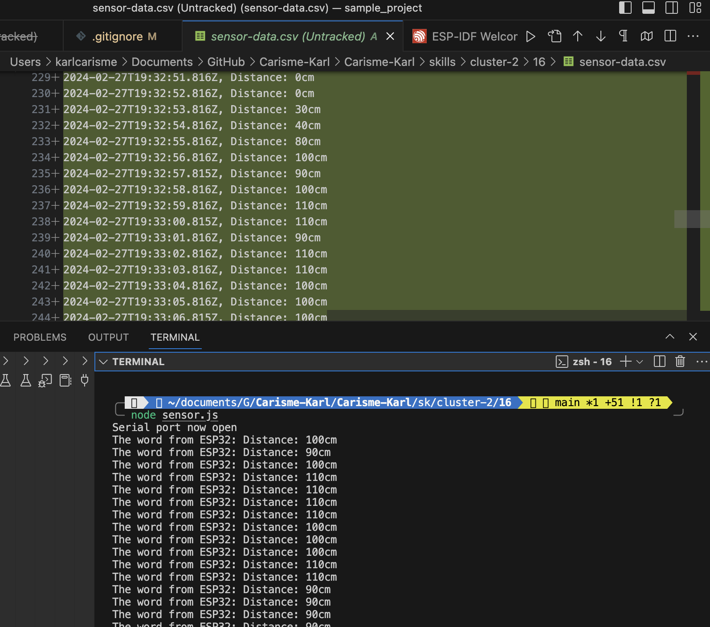

# Karl Carisme
# 02 - 27 - 2024

# Description
This Node.js skill quest establishes a connection to the ESP serial port and listens for incoming data that reads the distance from an IR range sensor. Once the data is received by Node.js, it is combined with a timestamp, and simultaneously, this data is formatted into a CSV file.

# Reference
https://www.w3schools.com/nodejs/nodejs_intro.asp
https://serialport.io/docs/api-parser-delimiter
https://github.com/BU-EC444/04-Code-Examples/blob/main/serial-esp-to-node-serialport/node/serial-node.js
# Photo

