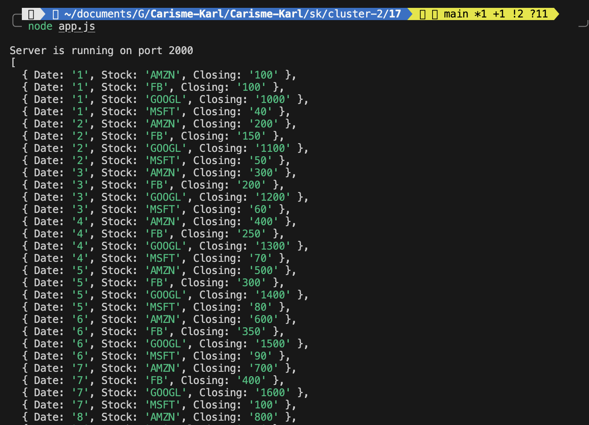
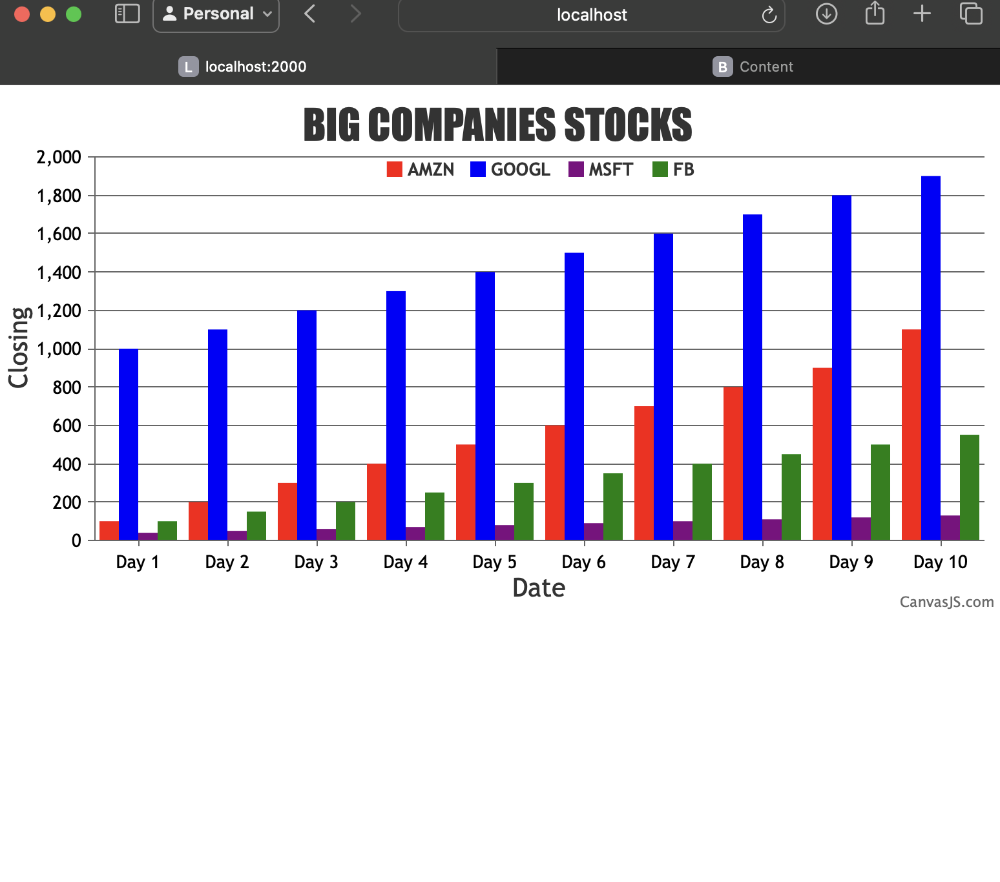

# Karl Carisme
# 02 - 28 - 2024

# Description
I create a node app that shows charts of stock market data from four different companies using CanvasJS. A Node.js server sends the data to a webpage, avoiding security errors by not reading files directly from the browser. The app uses Socket.io to send data from the server to the page quickly. Instead of putting the data right into the code, it reads from a file, making it easy to update.

# References
https://canvasjs.com/javascript-charts/
https://github.com/BU-EC444/01-Ebook-S2024/blob/main/docs/design-patterns/docs/dp-socketIO.md
https://canvasjs.com/docs/charts/how-to/create-charts-from-csv/
https://github.com/BU-EC444/04-Code-Examples/tree/main/serial-canvas

# Photos

