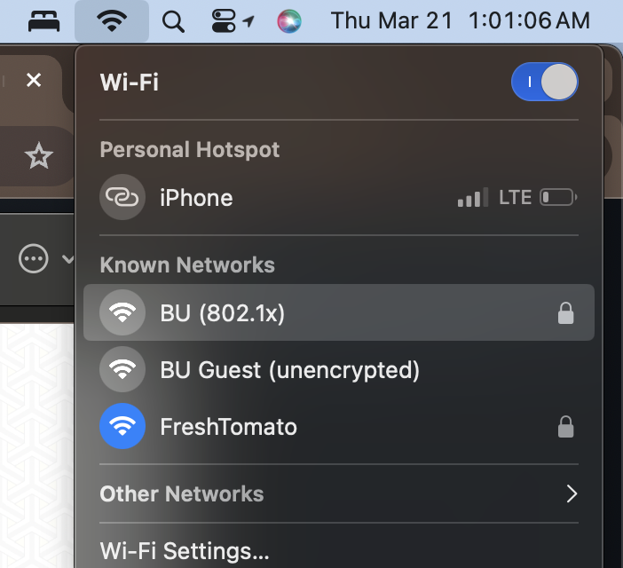
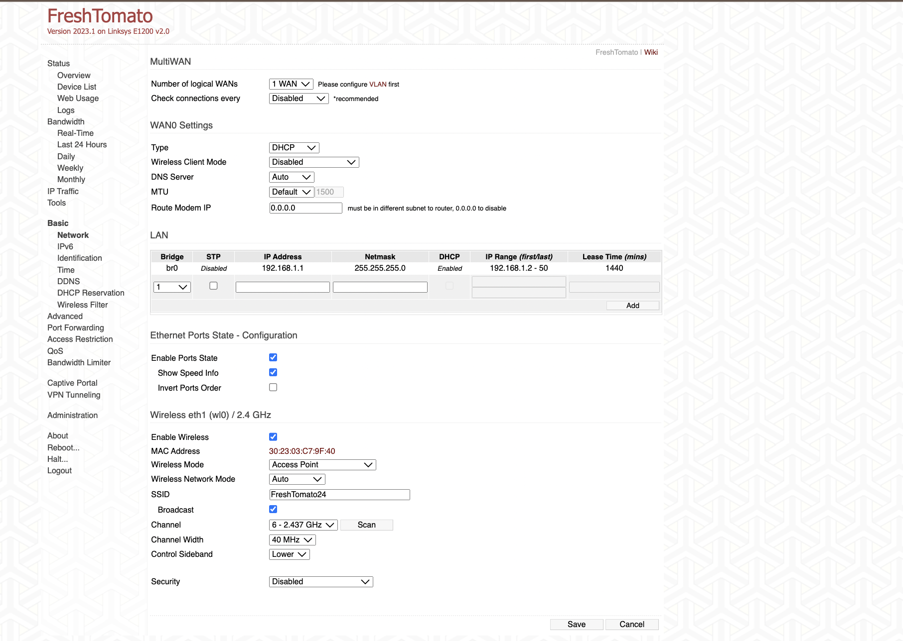
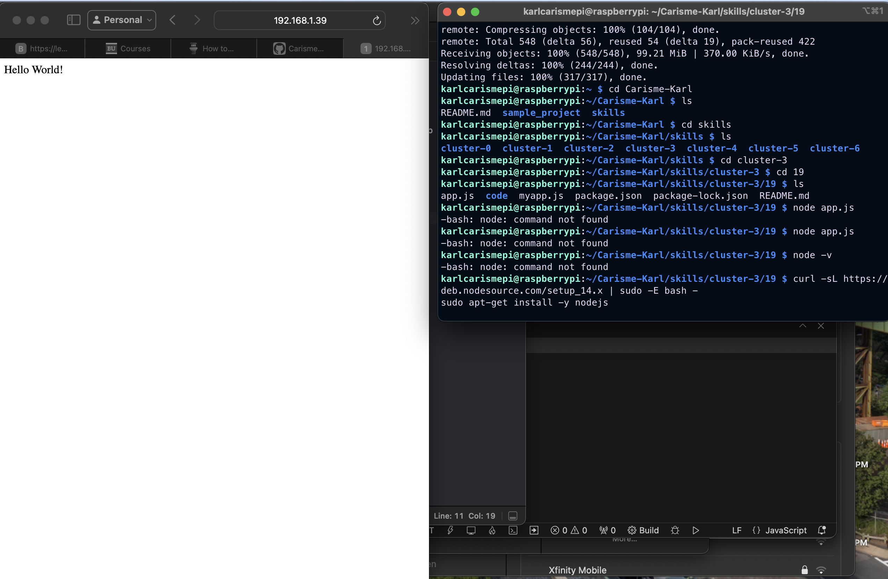
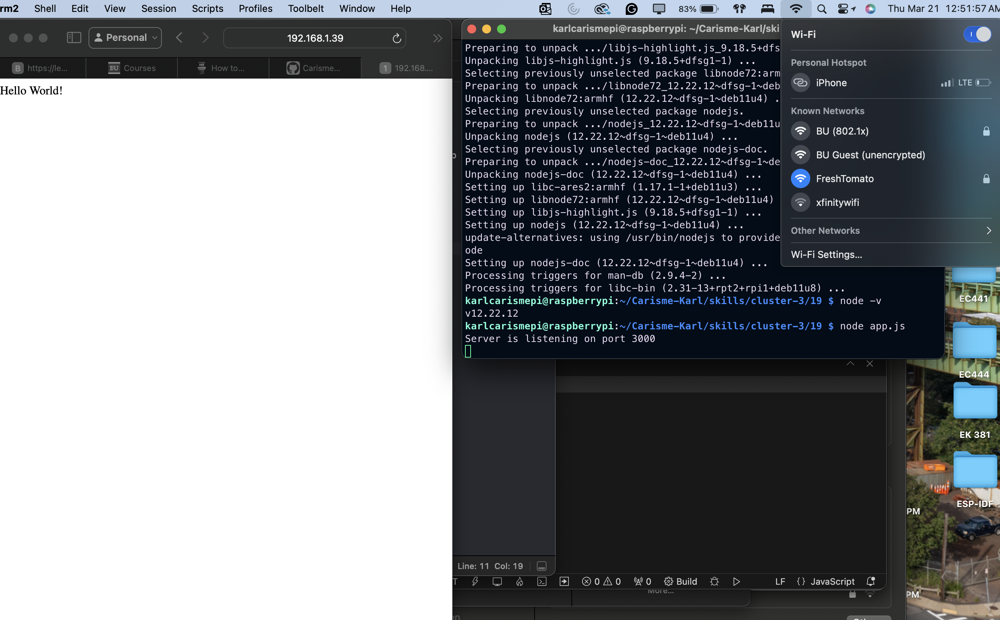

# 19a
# Karl Carisme
# 03 - 20 - 2024

# Description
 I connected a router with Ethernet and reset it, then adjusted all the settings to the preferred configuration.

# Photos 

# 19b
# Description

I set up a rasberry pi zero and created a bsic web server, using nodejs, to display an Hello World! message using the rasberry pie IP adress with the corresponsing port number while connecting to my router, FreshTomato.

# Photos 

