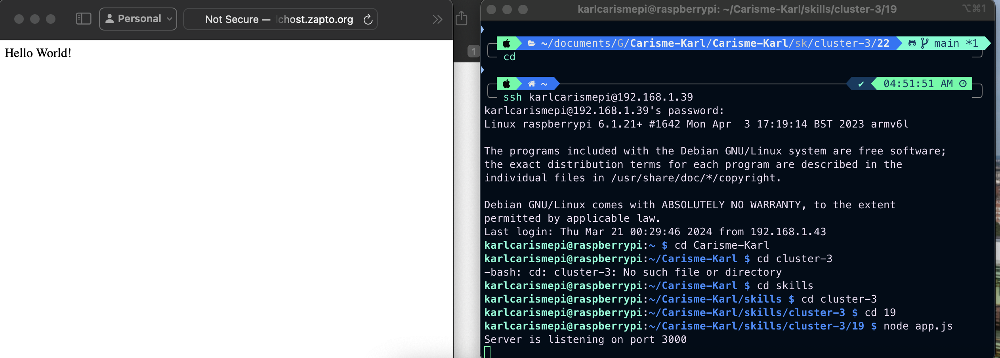

# Karl Carisme
# 03 - 21 - 2024

# Description
I set up my router for DDNS and port forwarding, I used the rasberrypi to run nodejs as a server to run a program on any network local or external.
In this skill I set up the router for DDNS and port forwarding. I used our team wifi and our team hostname to render the Hello World home page node server housed in myfirst.js.

# Photos 

# Video
[Click here to see the video](https://drive.google.com/file/d/1YPrkbqGSGlwdcYeNlWk-WqFh_b34oJZf/view?usp=sharing)

# References
https://my.noip.com
https://whatismyip.org
skills 19b, rasberrypi was used

