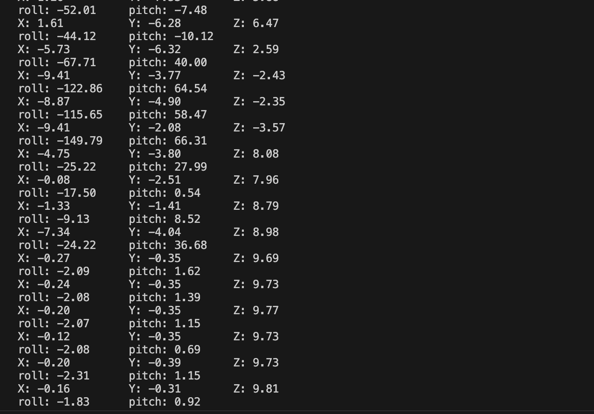

# Karl Carisme
# 03 - 21 - 2024

# Description 

I used the ADXL343 sensor to measure acceleration across three different axes and calculated roll and pitch based on the readings using mathematical formulas.

# References
https://cdn-learn.adafruit.com/assets/assets/000/070/556/original/adxl343.pdf?1549287964
https://docs.espressif.com/projects/esp-idf/en/latest/esp32/api-reference/peripherals/i2c.html
https://github.com/adafruit/Adafruit_ADXL343

#Photos

