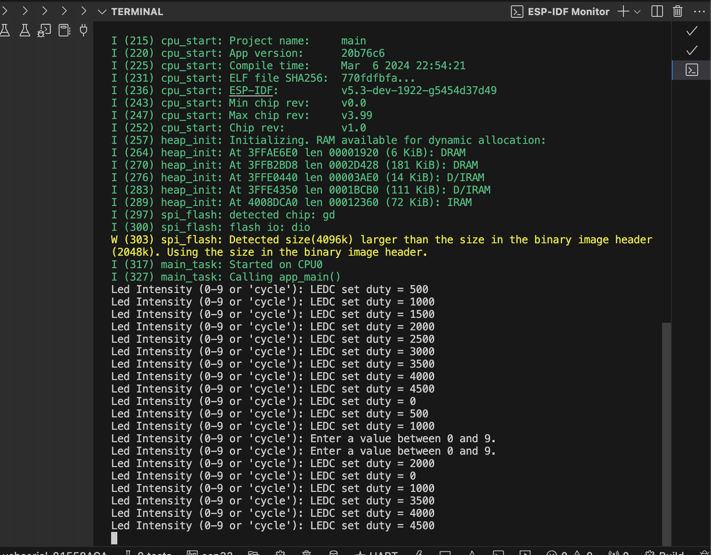
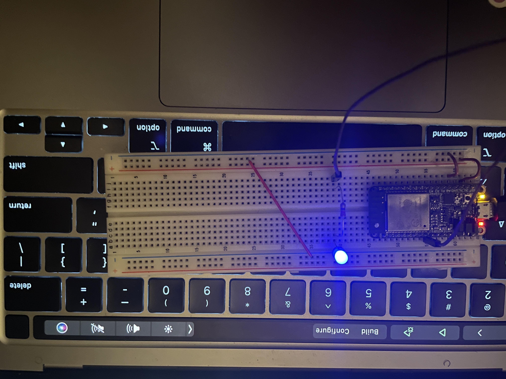

# Karl Carisme
# 03 - 21 - 2024

# Description
I made a program that changes how bright an LED is by using the power it gets. Users can type numbers 0-9 to see different light levels. Typing "cycle" makes the light go from dim to bright and back to dim in steps, then asks for a new light level.

# Photos 

# Video
[CLICK HERE TO WATCH THE VID](https://drive.google.com/file/d/15RUfc9Qe1ApT-b_Lo_5ezkI9s1596XHy/view?usp=sharing)

# References 
https://github.com/BU-EC444/01-Ebook-S2024/blob/main/docs/design-patterns/docs/dp-pwm.md
