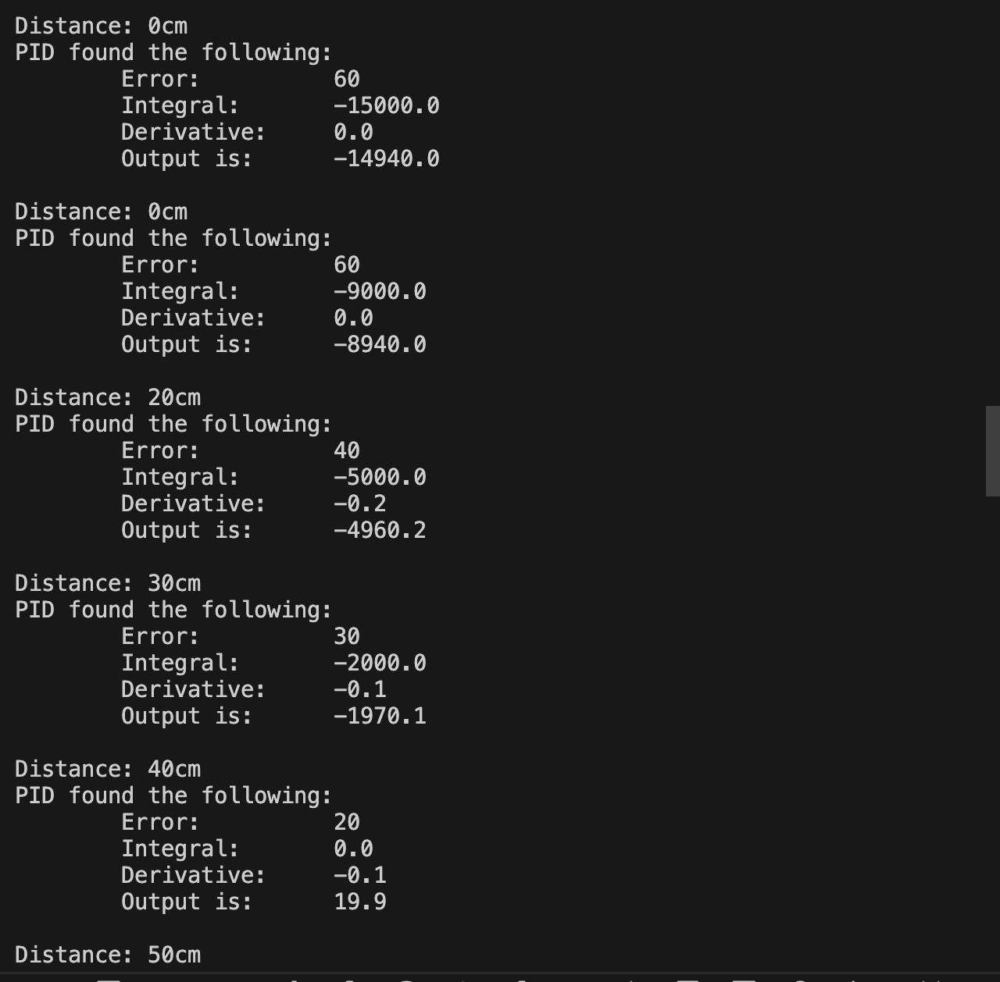
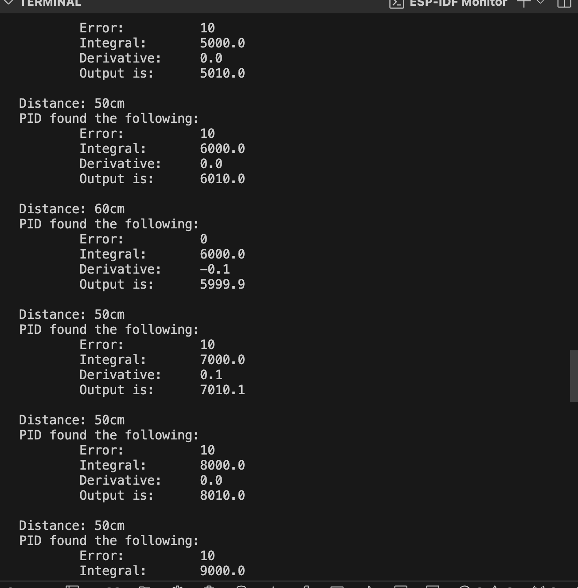

# Karl Carisme 
# 04 - 09 - 2024

# Description 
I connected the IR range sensor with three didferent LEDs, and implemented a PID algorithm that computes the "error" based on a predetermined setpoint, which we set at 60cm. In each cycle, with a duration of dt set to 25, the PID algorithm determines the error, the cumulative error (integral), and the rate of change of the error (derivative). The Red led lights up when the error is negative, The blue led is turn on when the error is positive, and the green led(another red led, I don't have a green led) turn on when the error is zero.

# Photo

# Reference 
Algorithm from 

https://github.com/BU-EC444/01-Ebook-S2024/blob/main/docs/design-patterns/docs/dp-pid.md
Please describe in this readme what is in your code folder and
subfolders. Make it easy for us to navigate this space.
