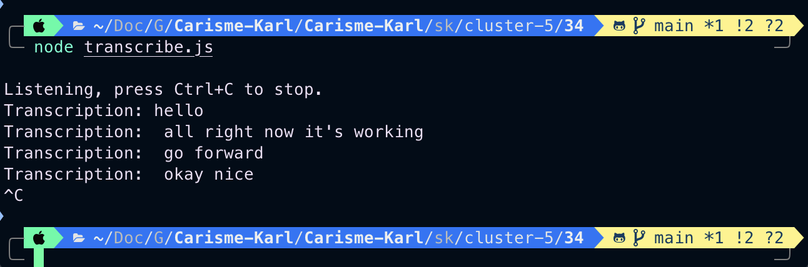

# Speech to text 
# 04 - 18 - 2024

# Description
  Set up a speech to text using the google cound api, with node.js implementation.

# Photo

# Video
[Video]()

# Configuration

--Navigate to Google Cloud Console

--On the Google Cloud Console, navigate to the "IAM & Admin" section and select "Service Accounts"

--Create a service account then create a key, which will be a .json files, it will automatically download on your computer 

--export GOOGLE_APPLICATION_CREDENTIALS="/path/to/your/service-account-file.json"

--Sound exchange library 

   brew install sox
   or 
   sudo apt-get install sox
   sudo apt-get install libsox-fmt-all

--cd /path/to/your/nodejs/project

--then npm install node-record-lpcm16 --save

--export GOOGLE_APPLICATION_CREDENTIALS="/secure/path/to/your-key-file.json"
  or 
  set GOOGLE_APPLICATION_CREDENTIALS=C:\secure\path\to\your-key-file.json

--install client library 
   npm install --save @google-cloud/speech
  or yarn add @google-cloud/speech

# Reference
Google cloud api
